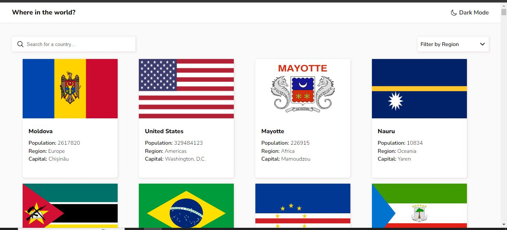

# Rest Countries API

Nesse projeto tenho como objetivo, criar a aplicação onde o usuário consegue realizar a pesquisa sobre países, porém tenho que construir com funções que buscam esses dados em uma API para exibir para o usuário. E também irei deixar o design do projeto conforme modelo abaixo:

## Menu

- [Meu Processo](#meu-peocesso)
- [Screenshot](#screenshot)
- [Link](#link)
- [Construido com](#construido-com)
- [Contatos](#contatos)

### Meu Processo

Para o desenvolvimento desse projeto estou utilizando os passos conforme listados abaixo:

- [X] Montar estrutura básica;
- [X] Estruturar estilos css para o header;
- [X] Header: Criar função para mudar thema;
- [X] Estruturar estilo css do container de pesquisa e filtro;
- [X] Container Filtro: Criar lista dropdown;
- [X] Estilização do css info. dos países (página principal);
- [X] Estilização do css info. dos países (página detalhes);
- [X] Finalizar função de troca de tema;
- [X] Conectar projeto a API;
- [X] Exibindo todos os países na página inicial;
- [X] Criar funções de navegação entre páginas;
- [X] Desenvolver método de busca página principal;
--
- [X] Criar páginas para detalhes dos países;
- [X] Abrir página de detalhes ao clicar no card do país;
- [X] Realizar a consulta na API com os detalhes do país selecionado;
- [ ] Criar função para tratar os dados recebido da API;
- [ ] Função para exibir todas as líguas do país;
- [ ] Função para gerar países de fronteira;
- [ ] Exibir dados na página de detalhes do país;
- [ ] Criar função de filtro por região na página principal;

### Screenshot

<!--Abaixo estou deixando um screenshot do design final do projeto conforme desenvolvi:-->

<!--  teste-->

### Link

<!--Estou deixando abaixo o link com o deploy do projeto para visualização direto no navegador:-->

<!--- Para acessar o formulário clique [aqui](https://multi-step-form-dusky-gamma.vercel.app/)-->

<!--### Aprendizados

Durande o desenvolvimento dessa aplicação aprendi uma melhor maneira de como estruturar as páginas do site, então realizarei uma refatoração dos códigos para deixar melhor estruturado. Com isso aprendi mais sobre o sistema de navegação do JavaScript.-->

### Construido com

As tecnologias utilizadas para esse projeto são as listadas abaixo:

- Semantic HTML5 markup
- CSS custom properties
- JavaScript

### Contatos

[LinkedIn](https://www.linkedin.com/in/lucas-boarini)